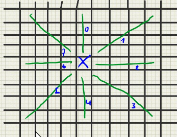

# Five Wins

### A game for SE

The game is a project for or lecture "SE". In which we should learn to use some programs, which help us to get better
code and implementation and to handle with the written code.

### The Rules:

At first you must decide if you like to play against the computer or a friend. Then you must choose a field size.
We prefer a size between 15 an 19. You always can place one stone, then it's your opponents turn.
The goal of this game is to get five stones in one row.
vertical, horizontal or diagonal, all is possible. Just without an edge.

### Several Informations:
For this game we used the MVC-Arcitecture. 
To improve our code we used Sonar, Maven and Jenkins. We also followed the approach of testing first principle(it's part of xp), used OO-Principles and Design Patterns.
For better collaboration we used scrum and git.
In Scrum we coordinated our collaboration, who had which task. We used git for version control, so that everybody can access the code all the time. 

Before we started to create the gui we created a tui(TextUI). The TextUI print all commands and intermediate stage on the console. After the TextUI and the other parts worked and were tested we created the gui. Since the gui is implemented the TextUI is used as a logger.

### How you can play
After you import the program to your locale git you can start the game by running the fivewins.java. The gui will start. Now you can decide between Player vs. Player and Player vs. NPC

If you choose Player vs. Player a pop up appears and ask you which game field size you would like to have. Insert a number between 1 and 20 and press the 'OK' Button. Now you can play a game with your friend.

But if you choose Player vs. NPC then appears two new button where you can choose between the Weak or Strong AI. After that two other buttons appears and you can choose which player sign the npc get. If you press 'X' the NPC will start and if you press 'O' you will start. Finally a pop up appears and ask you which game field size you would like to have. Insert a number between 1 and 20 and press the 'OK' Button. Now you can play against the NPC of your choice.

While Playing you can restart the match or go back to the main menu. Click on 'datei' and choose what you want.

### How it works
Enough with the kiddie. Let's talk about the implementation.

#### Model-Layer
In the Model-Layer are the game field and the ai(artificial intelligence).
The game field is implemented with a 2 dimensional String array. The constructor fills it with a default value. The default value is __-__. So __never__ use __-__ as a player sign.

The ai use the template method. We choose that because the VerySimpleAI.java(Weak AI) and the StrongAI.java(Strong AI) should be the same approachable. Only the strong ai should play better.

#### View-Layer
We have two layers. One is the gui and the other is the tui(TextUI). The gui is used mainly. The tui is just there for logging. So you can find easier mistakes.

#### Controll-Layer
The controll-layer is the connecting piece for the both other layers. 
The important part in the controller is the win request.

How does the win request work?
The alorithm is based on this picture:

The algorithm saves the last x- and y-coordinate and test from this position the next 5(if the gamefield is bigger than 4X4 otherwise the gamefield size is used) in all directions. 

